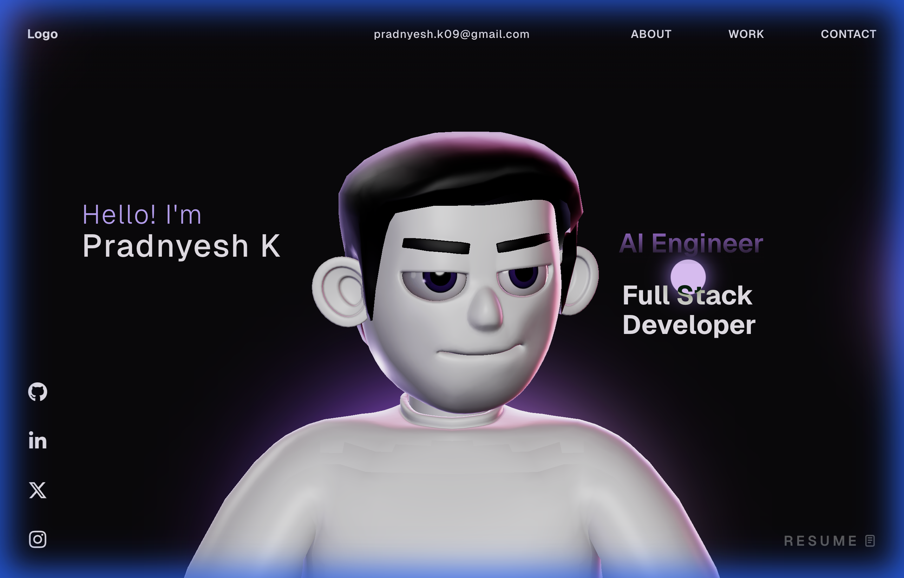

# My Portfolio Website 🚀



A high-performance, immersive developer portfolio built with modern web technologies. This project showcases 3D interactive elements, smooth animations, and a responsive design to provide a unique user experience.

🔗 **Live Demo:** [https://my-portfolio-jgst.vercel.app/](https://my-portfolio-jgst.vercel.app/)

## 🛠 Tech Stack


*   **React** - UI Library
*   **TypeScript** - Static Typing
*   **Three.js / React Three Fiber** - 3D Graphics & Interactions
*   **GSAP** - Professional Animations
*   **TailwindCSS** - Styling (if applicable, otherwise CSS)
*   **Vite** - Build Tool
*   **Groq API** - AI Integration for Chat

## ✨ Features

*   **3D Hero Section**: Interactive 3D elements powered by Three.js.
*   **Smooth Animations**: Seamless transitions and scroll effects using GSAP.
*   **AI Chat Assistant**: Integrated chat feature to interact with visitors using Groq API.
*   **Responsive Design**: Fully optimized for all device sizes.
*   **Performance Focused**: Optimized assets and code splitting for fast load times.

## 🚀 Getting Started

### Prerequisites

Ensure you have [Node.js](https://nodejs.org/) installed on your machine.

### Installation

1.  **Clone the repository**
    ```bash
    git clone https://github.com/Voyager10-ai/My_Portfolio.git
    cd My_Portfolio
    ```

2.  **Install dependencies**
    ```bash
    npm install
    ```

3.  **Set up Environment Variables**
    Create a `.env` file in the root directory and add your Groq API key:
    ```env
    GROQ_API_KEY=your_api_key_here
    ```

4.  **Run the development server**
    ```bash
    npm run dev
    ```

## 📦 Deployment

This project is optimized for deployment on [Vercel](https://vercel.com/).

1.  Push your code to GitHub.
2.  Import the project into Vercel.
3.  Add the `GROQ_API_KEY` environment variable in Vercel settings.
4.  Deploy!

## 📄 License

This project is open source and available under the [MIT License](LICENSE).
